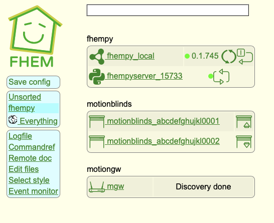

# Motion Gateway Module for FHEM

## An FHEMPY module to make use of motionblinds python library

After installing the motionblinds library (as explained in the motionblinds fhempy module (make sure that the __init__.py of the library is modified).

### this module is intended to interface with a motionblind HUB

The motionblind HUB maintains the available binds it can control.
this module should be able to
+ if IP address and key of the hub specified, it connects to the HUB and request hte list of known devices
+ if the IP address of the hub is not specified, it search for a HUB and defines it accordingly

## MODE
+ sim, will use a predefinedd set of blinds as scan result
+ live scan of the network to detect the gateway/hub using Discovery

  
## Use

when installed, define the gateway to fhem 

    define mgw fhempy motiongw

Change mode to live and enter the gateway key (via the set)

    Set mgw scan 

or run the set scan from the device

Once the scan is finished, the gateway displays the devices found in the readings, for each blind discovered, a motionblinds device will be automatically created and can be found in the room fhempy

the Blinds will be named motionblinds_[mac address as reported]

Room fhempy with the created elements

